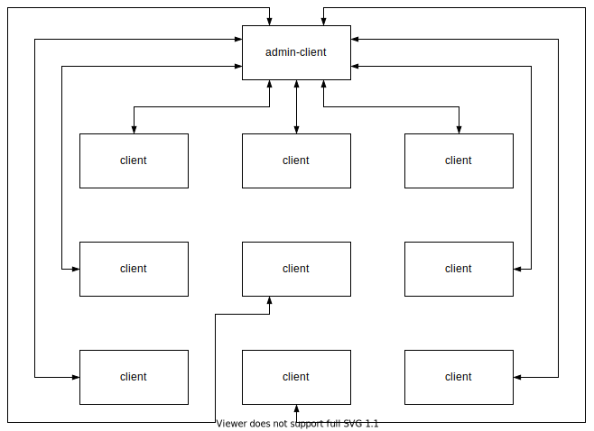
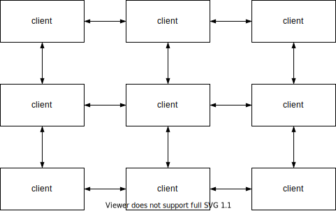
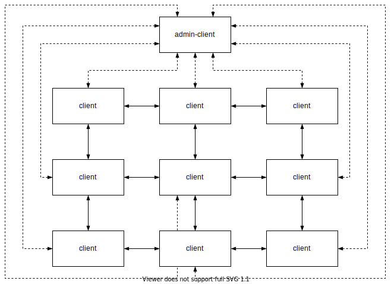
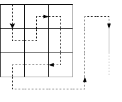

# butchered-client

One of many.

## Table of contents

1. [Serving the frontend](#1-serving-the-frontend)  
   1.1 [Prerequisites](#11-prerequisites)  
   1.2 [Configuration](#12-configuration)  
   1.3 [Serve](#13-serve)
2. [Communication](#2-communication)  
   2.1 [Principle](#21-principle)  
   2.2 [Events](#22-events)
3. [Game logic](#3-game-logic)  
   3.1 [Board](#31-board)  
   3.2 [Snake](#32-snake)  
   3.3 [Collisions](#33-collisions)
4. [Things to address in the future](#4-things-to-address-in-the-future)

## 1. Serving the frontend

The following describes how get the frontend up and running.

### 1.1 Prerequisites

- node.js with Typescript installed
- install dependencies (`npm install`)
- Angular CLI installed (`npm install -g @angular/cli`)

### 1.2 Configuration

There are two exisiting configurations inside `src/environments`. One for development purposes and one for production.  
The easiest way is to update the existing development environment file, which has the following properties:

```ts
export const environment = {
    production: false,
    backendUrl: 'ws://backend-url:6969', // the url to the butchered-backend
    boardSize: 18, // the width/height of the individual clients' boards with walls (-2 for actual playable area)
    snakeSize: 3 // initial snake length, should be at least 3
};
```

### 1.3 Serve

To serve the frontend run:

```bash
ng serve [options]
```

Refer to the [cli documentation](https://angular.io/cli/serve) for available options.

## 2. Communication

The following describes the communication model.

### 2.1 Principle

As described in the [butchered-backend readme](https://github.com/butchered-snake/server/README.md) one client can
create a game and is considered the admin for this game. Other clients can then join the game. The admin's and the
client's responsibilities are strictly separated. That means that everyone, including the admin, has an instance of the
client running. The admin has an additional admin-client running to handle the administrative tasks.

The admin-client establishes a WebRTC connection with every client when they join the game. This allows each client to
communicate with the admin. For nine clients this would look like this:  


During the game's startup sequence, each client is assigned a part of the overall playable area, in which he'll be able
to control the head of the snake. After that, every client uses the admin as a signaling channel to establish a WebRTC
connection with each direct neighbour (above, below, left and right). This allows for direct communication between the
direct neighbours. For nine clients it would look like this:  


With this architecture, every client has at most 5 connections. The admin-client has to keep track of as many
connections as clients joined the game, including the admin's client itself. The following combines the previous two
schematics:  


The hardcoded algorithm used to assign the individual board areas could be swapped out or made configurable in the
future. For now however, it follows a rectangular zigzag pattern:  


During this board creation, every client is assigned an identifier. The identifier is an encoding of the board position
in relation to the top left corner of the playable area. It is implemented as a 32 bit integer, where the first 16 bit
represent the x index and the the remaining 16 bit represent the y index. That means the top left board has the id 0.
The one below has the id 1 and the one to the right has the id 65536. As a result a client can deduce in which direction
another client is placed based on it's id. This will be used in the event system which is elaborated next.

### 2.2 Events

The basis for all communication between the different clients are events. The client and admin-client implement handlers
for the different event types.

The following are events used in communication between admin-client and client. They inherit the `AdminEvent` type which
could be used in the future to provide additional information.

| event                 | data                                                         | usage                                                                                                                   |
|-----------------------|--------------------------------------------------------------|-------------------------------------------------------------------------------------------------------------------------|
| SetClientId           | id: number                                                   | admin instructs client to assign itself the id                                                                          |
| RequestOffer          | from: number, fromName: string, to: number                 | admin requests offer from client                                                                                        |
| ProvideOffer          | from: number, fromName: string, to: number, offer: string | client provides offer to admin; admin forwards event to destination client                                              |
| ProvideAnswer         | from: number, to: number, answer: string                   | client provides answer to received offer; admin forwards answer to client that provided offer                           |
| ConnectionEstablished | from: number, to: number                                    | client reports that the connection to one of his neighbours has been established                                        |
| PlaceSnake            |                                                              | admin instructs client to place the initial snake                                                                       |
| StartGame             |                                                              | admin instructs all clients to navigate to their board view                                                             |
| NavigatedToGame       | from: number                                                 | client reports it has navigated to the board view                                                                       |
| StopGame              | reason: string                                               | client reports to the admin that the snake died; admin instructs all clients to display the game over message           |
| Tick                  |                                                              | admin instructs all clients to run their update routine                                                                 |
| SetFood               |                                                              | admin instructs client to place food on the board                                                                       |
| PlacedFood            | newPos: Position, from: number                              | client reports that it has placed the food                                                                              |
| FoodPosUpdate         | newPos: Position, from: number                              | admin instructs all clients to update their food indicator                                                              |
| FoodEaten             |                                                              | client reports that the food has been eaten; admin forwards event to all clients to make the snake grow at the tail end |

The following are events used for the communication between neighbours. They inherit the `NeighbourEvent` type which
stores the own client's id as the source of the event (the `direction` parameter in the `data` column). That way
receivers can always determine the direction of the event emitter.

| event                 | data                                   | usage                                                                                                               |
|-----------------------|----------------------------------------|---------------------------------------------------------------------------------------------------------------------|
| HeadPosUpdate         | direction: Direction, newPos: Position | client reports to all neighbours the new head position; neighbours update their head indicator accordingly          |
| HeadEntering          | direction: Direction, oldPos: Position | client reports to neighbour that the head will enter the neighbour's board                                          |
| TailEntering          | direction: Direction, oldPos: Position | client reports to neighbour that the tail will enter the neighbour's board                                          |
| HeadPosLeavingContext | direction: Direction                   | client reports to all neighbours that the head is leaving it's board and instructs to invalidate the head indicator |

From these events its clear what information an individual client knows about the board as a whole:

- neighbours:
    - count
    - name
    - direction
- food:
    * if in own board: exact position
    * otherwise: an indicator on the border of the board
- head:
    * if in own board: exact position
    * if in neighbour's board: an indicator on the border of the board
    * otherwise: no clue at all
- tail:
    * if in own board: exact position or
    * otherwise: no clue at all
- body:
    - body parts inside own board
    - rest is unknown

## 3. Game logic

The following describes some implementation details about the actual representation and gameplay of snake.

### 3.1 Board

The backbone of the gameplay is the board. It consists of `boardSize` x `boardSize` cells. Each cell can have a single
state which dictates the rendered content.  
When starting the game, the head is placed in the middle of a random player's board, by setting it's state to `Head`.
Then `snakeSize` - 2 body parts are placed to the right by setting the cell states to `Body`. Finally the tail is placed
to the right by settings the cell state to `Tail`. Other possible cell states include `Free`, `Food`, `Wall`
, `Neighbour`.  
The borders of the board are either set to `Wall` or `Neighbour`. Additionally the indicators for food and the head are
placed on the borders.

### 3.2 Snake

The snake is represented by a `head` and a `tail`. The `tail` stores its postion and a fifo-queue of directions. Once
a `Tick` event is received, it will pop the next direction of the queue, sets the previous position's state to `Free`
and moves to the next position based on the popped direction.  
The `head` stores its position and the direction it should move next. Once it receives a `Tick` event by the admin, it
will move to the next cell updating its state and set the state of its previous position to `Body`. Additionally it will
push the direction into the fifo queue of the tail.  
When the head moves through the client's board, the directions it took are stored inside the tail's fifo-queue and it
will constantly produce body cells behind it. As soon as the tail enters the client's field it will start to pop the
queue and take the same path as the head replacing the next body part with itself and setting it's previous position
to `Free`. Each client is only storing its part of the snake. That means no matter how long the snake is, a client will
at most have to store (`boardSize` - 2) x (`boardSize` - 2) elements inside the fifo queue.  
When a clients board contains the tail and a `FoodEaten` event is received, a `NoDirection` element is appended to the
queue. That way the tail will stay in place for the next `Tick` event.

### 3.3 Collisions

The design of the board enables easy collision detection by querying the state of the desired next position in the
board. The following will list reactions to possible collisions.

For the `head` colliding with:

- wall, body, tail: emit `GameStopped` event to admin
- food: emit `FoodEaten` event to admin
- neighbour: emit `HeadEntering` event to the neighbour in current direction of the head

For the `tail` colliding with:

- neighbour: emit `TailEntering` event to the neighbour in the last popped direction

## 4. Things to address in the future

1. This project was created in the span of a weekend with a few days after that spent on bug fixing. Because of that
   some parts of the code might not be the prettiest. This could be improved when more time is available for personal
   projects.
2. The WebRTC handshake has a few small issues which are currently solved by simply retrying the handshake if it fails.
3. Currently the admin-client acts as the master node of the distributed game. That makes it the performance bottleneck
   and single point of failure. Some experimentation with distributing the admin tasks on more than one client should be
   done to make it more robust.
4. The game is only really fun and chaotic when the snake is really long. Currently the initial snake length is limited
   to `boardSize` / 2 - 1. A more sophisticated algorithm could be implemented to allow for a larger snake to be created
   at the start.
5. The current algorithm to place a new piece of food picks a random client and instructs it to place the food. Then the
   client determines a viable position (which is not obstructed by anything) and reports it back to the admin. The
   problem is that it's possible (although very unlikely) that the client cannot find a viable position. This case is
   not handled yet and should be considered in the future. Additionally it might be interesting to have more than one
   piece of food when there are a lot of players to keep the pace of the game  """fast""".
6. This is a nice POC for a distributed snake using WebRTC. However, it is not viable for a production release yet. This
   would be something to work towards when there is more time available, because the overall feedback to this game idea
   has been overwhelmingly positive. 
